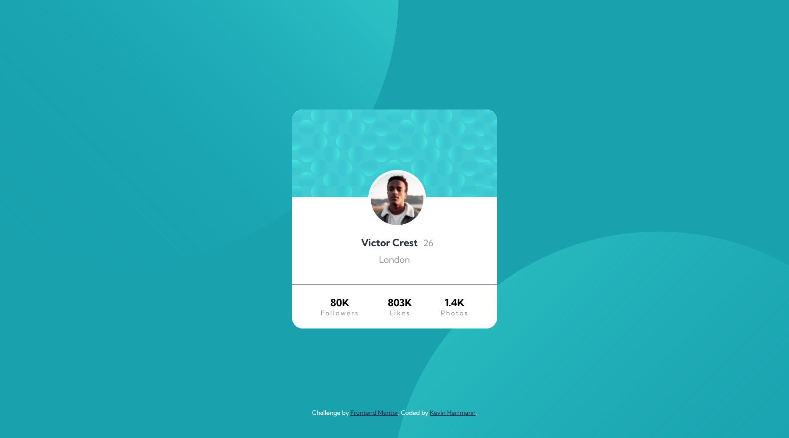
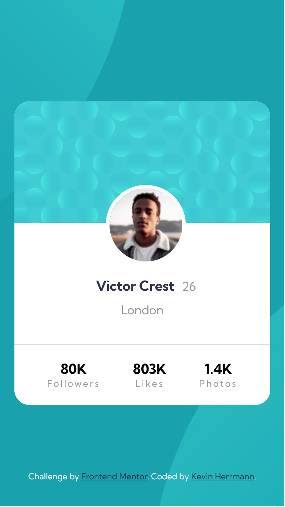

# Frontend Mentor - Profile card component solution

This is a solution to the [Profile card component challenge on Frontend Mentor](https://www.frontendmentor.io/challenges/profile-card-component-cfArpWshJ). Frontend Mentor challenges help you improve your coding skills by building realistic projects. 

## Table of contents

- [Overview](#overview)
  - [The challenge](#the-challenge)
  - [Screenshot](#screenshot)
  - [Links](#links)
- [My process](#my-process)
  - [Built with](#built-with)
  - [What I learned](#what-i-learned)
- [Author](#author)

## Overview

### The challenge

- Build out the project to the designs provided

### Screenshot

### Links

- Solution URL: [Add solution URL here](https://your-solution-url.com)
- Live Site URL: [Add live site URL here](https://your-live-site-url.com)

## My process

### Built with

- HTML5 markup
- CSS custom properties
- Google Fonts
- Flexbox
- Positioning
- Desktop-first workflow
- Mobile breakpoint

### What I learned

Postitioning became a real challenge in this one, especially trying to line up the background spheres. I'm not confident that I did it the best way, but the end result seemed to work.

Also, doing multiple Flexbox areas became a challenge trying to keep them all straight. Trying to figure out how to create the three sections of the card was also challenging. Again, not sure I figured out the best way, but a way where it reached the end result.

## Author

- Frontend Mentor - [@kevinx9000](https://www.frontendmentor.io/profile/kevinx9000)
- Twitter - [@KevHerrmann](https://www.twitter.com/KevHerrmann)
